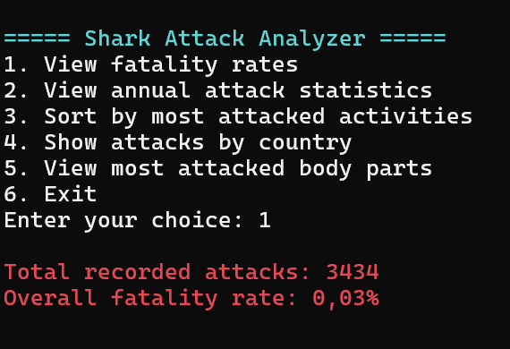
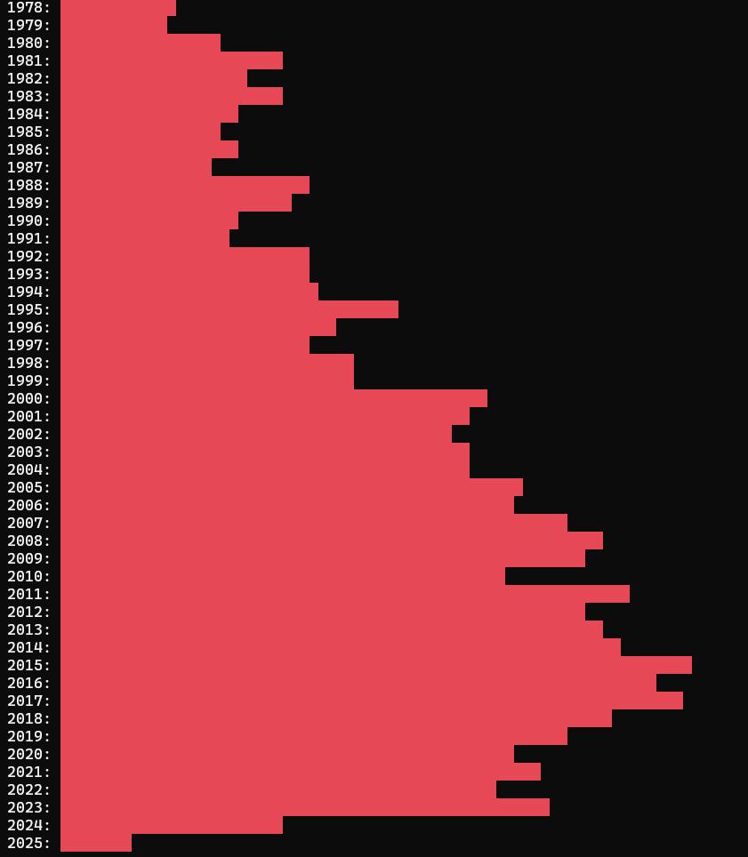
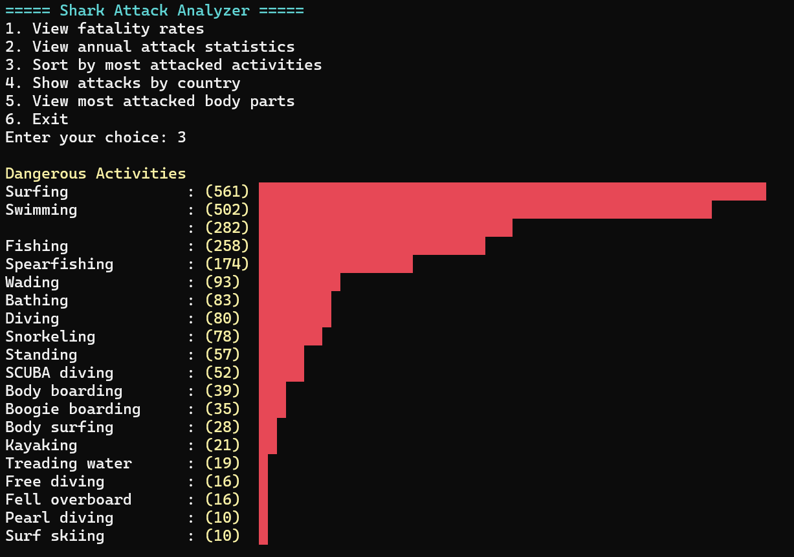
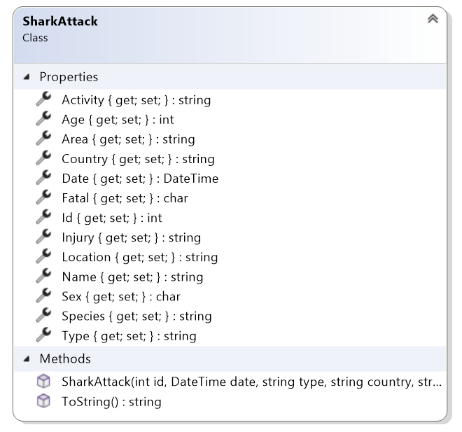
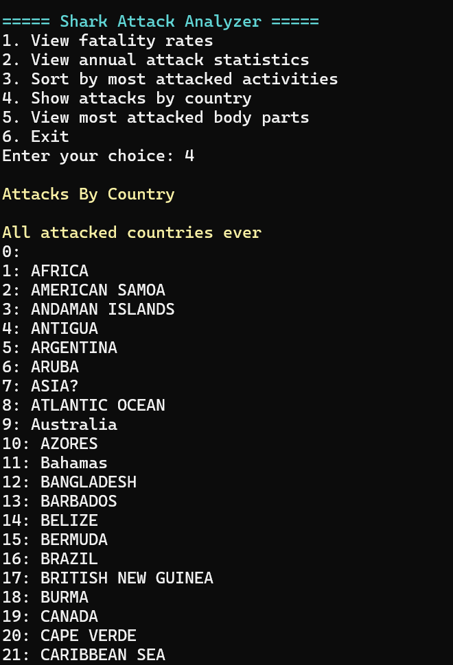
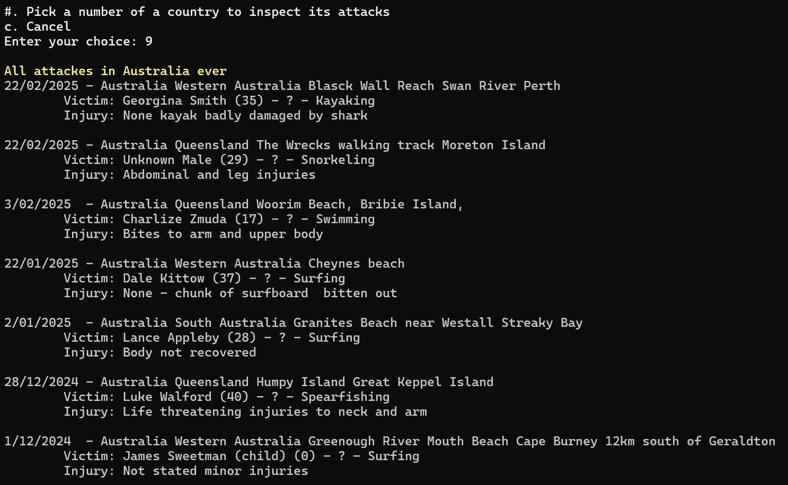

# ADO.NET Connected - 3 - Shark Attacks

[](http://www.youtube.com/watch?v=BX3bN5YeiQs "JAWS")

Ontwikkel een Console Applicatie in C# die informatie afhaalt van een database. De applicatie analyseert aanvallen van haaien. Er bestaat reeds een Console-menu, maar de achterliggende functies van de SharkAttackClassLibrary moeten nog ingevuld worden.

In SharkAttackData staan reeds enkele methode, maar hun invulling ontbreekt nog

Gebruik het onderstaande script om de table aan te maken in je eigen database:

> [!IMPORTANT]  
Voer het script uit voor je begint aan de opgave!

### SQL Shark Attack CREATE script
<details>

```

```

</details>

> [!CAUTION]
> De data van deze dataset is eeuwen oud en bevat veel "messy" records. Er is data die ontbreekt en veel rijen bieden weinig consistentie. Je zal zelf moeten rekening houden met het verwerken van "missing", "messy" data.

## 1. Overall Stats
In dit onderdeel ga je ExecuteScalar() gebruiken om totaalresultaten op te vragen van de database.

1. Maak de methode `GetTotalAttakcs()` die alle aanvallen uit de database telt en retourneert.
2. Maak de methode `GetFatalityRate()` die het percentage aanvallen retourneert waar het accident fataal was (Fatal = Y).




## 2. Yearly Shark Attacks

In dit onderdeel ga je SELECT-skills bovenhalen om de jaartalen te groeperen en te sorteren van oud naar nieuw.

Maak de methode `GetAttacksByYear()` die een `Dictionary<int, int>` retourneert. 
 * De Dictionary heeft als keys de jaartallen en als value de hoeveelheid aanvallen van dat jaar over heel de wereld.
 * De Dictionary wordt opgebouwd in de volgorde: oud naar nieuw.
 * Maak gebruik van een `SqlDataReader`. 



## 3. Dangerous Activities

Gelijkaardig aan de vorige opgave ga je te werk met een `SqlDataAdapter` om een Dictionary op te bouwen.

Maak de methode `GetAttacksByActivity()` die een `Dictionary<string, int>` retourneert.
 * De Dictionary heeft als keys de verschillende activiteiten en als value de hoeveelheid aanvallen voor die activiteit ooit.
 * De Dictionary wordt opgebouwd in de volgorde: meeste aanvallen naar minste aanvallen. *(Kijk naar de onderstaande afbeelding voor het gewenste resultaat.)*
 * Maak gebruik van een `SqlDataReader`.




## 4. Attacks By Country

In deze opgave ga je de brug maken van database naar C# objecten. Het doel is om een overzicht te laden voor een specifiek land dat de gebruiker mag kiezen. Hiervoor ga je de rijen uit de database omzetten naar SharkAttack objecten.

1. Maak een class `SharkAttack` die overeenkomt met de onderstaande class diagram. 
	a. Voorzie de properties uit de diagram.
	b. Voorzie een constructor die een parameter ontvangt voor elke property.
	c. Voorzie een `ToString()` methode die een stuk tekst retourneert gelijkaardig aan de output op de laatste afbeelding.



2. Maak een methode `GetAllCountries()` die alle unieke landen uit de tabel uitleest en retourneert in een van `List<string>`. Sorteer alle landen op een alfabetische volgorde.



3. Maak een methode `GetAllAttacksByCountryName(string country)` die een `List<SharkAttack>` retourneert.
	a. Gebruik een `SqlDataAdapter` om elke rij uit te lezen en om te zetten in een `SharkAttack` object.
	b. Filter de aanvallen op het gegeven land.
	c. Sorteer de incidenten van het resultaat van nieuw naar oud.



## 5. Most Attacked Body Parts (Bonus)

Ga nu zelf aan de slag en ontdek de "vuiligheid" van ongefilterde data die buiten een schoolse context bestaat. Veel van de rijen hebben nog kuiswerk, filtering of extra logica nodig.

Net zoals je in *2. Yearly Shark Attacks* en in *3. Dangerous Activities* zal je een overzicht maken over de soort **Injury** en hoeveel aanvallen hier aan verbonden kunnen worden.

**MAAR!** Heel veel van de Injury records zijn niet consistent en hebben String filtering nodig.


### Veel succes
